<div align="center">

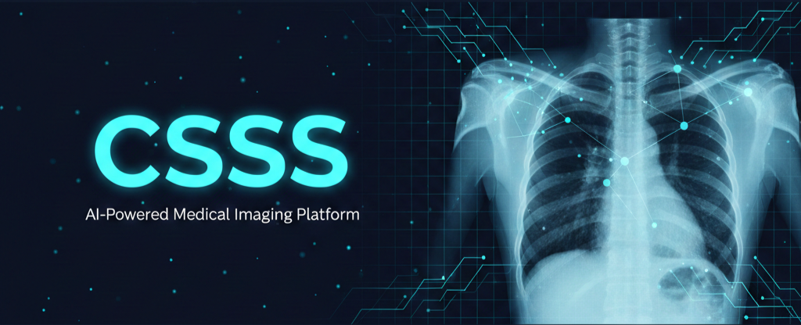

# 🧬 Clinical Scan Support System

### *AI-Powered Medical Image Diagnosis & Automated Clinical Reporting Platform*

[](https://www.python.org/)
[](https://fastapi.tiangolo.com/)
[](https://nextjs.org/)
[](https://www.tensorflow.org/)
[](https://arxiv.org/abs/1801.04381)
[](models/metrics/training_metrics.json)
[](https://www.kaggle.com/)
[](LICENSE.txt)
[]()

*From scan upload → AI inference → multi-role clinical review → encrypted PDF report delivery — fully automated in one platform*

[🚀 Quick Start](#-quick-start) • [🏗️ Architecture](#️-system-architecture) • [🧠 AI Pipeline](#-ai-model--pipeline) • [🔌 API Docs](#-api-endpoints) • [🧪 Workflow Demo](#-end-to-end-workflow-demo) • [🎓 Model Training](#-model-training--dataset-preparation) • [👥 Team](#-team)

---

> **⚕️ Medical Disclaimer** — CSSS is an AI-assisted screening tool designed to **support** qualified medical professionals. All AI predictions require review by a licensed physician before any clinical decision is made.

</div>

---

## 🎯 Overview

**Clinical Scan Support System (CSSS)** is a production-grade, full-stack AI medical imaging platform that automates the complete diagnostic pipeline — from patient scan upload through real-time MobileNetV2 inference, structured multi-role clinical review, to professional PDF diagnostic report generation and encrypted email delivery.

Built as a final-year engineering mini-project, CSSS tackles a real clinical bottleneck: traditional diagnostic workflows are manual, siloed, and slow. CSSS replaces this with a unified platform where every stakeholder — patient, doctor, pharmacist, and admin — has a purpose-built dashboard, enforced access control, and a clearly defined role in the pipeline.

### ✨ Key Features

| Feature | Detail |
|---|---|
| 🔍 **Multi-Modal Scan Support** | Chest X-ray (NIH), COVID-19 radiography, cardiac MRI |
| 🧠 **Deep Learning Inference** | MobileNetV2 — 89.51% test accuracy, sub-second prediction |
| 🔄 **4-Role Clinical Workflow** | Patient → Doctor → Pharmacist → Admin approval pipeline |
| 📄 **Auto PDF Report Generation** | WeasyPrint + Jinja2 HTML → professional diagnostic report |
| 📧 **SMTP Email Delivery** | Encrypted PDF automatically emailed to patient on approval |
| 🔒 **JWT + OTP 2FA Security** | Role-based access control, two-factor login for admin |
| 💬 **Medical AI Chatbot** | Context-aware assistant for patient FAQ and workflow help |
| 🎛️ **4 Role Dashboards** | Tailored UIs — Admin, Doctor, Pharmacist, Patient |
| ⚡ **Live Status Tracking** | Real-time scan status badges across all role dashboards |
| 📊 **Confidence Scoring** | Per-class probability output with automatic uncertainty flagging |
| 🗄️ **SQLite / PostgreSQL** | Lightweight local dev DB with production migration path |
| 🖥️ **Dark Theme SPA** | Responsive Next.js 14 frontend with cyan-accented dark UI |

### 🎯 Use Cases

- **Hospital Radiology Departments** — Streamline chest X-ray and CT report generation with AI pre-screening
- **COVID-19 Screening Clinics** — Real-time detection of COVID, Viral Pneumonia, and Lung Opacity patterns
- **Cardiac Screening Centers** — Automated normal/abnormal cardiac MRI triage
- **Telemedicine Platforms** — Remote scan submission with automated encrypted report delivery
- **Medical Education** — Demonstrate AI-assisted diagnostics with an end-to-end working system

---

## 🏗️ System Architecture

<div align="center">
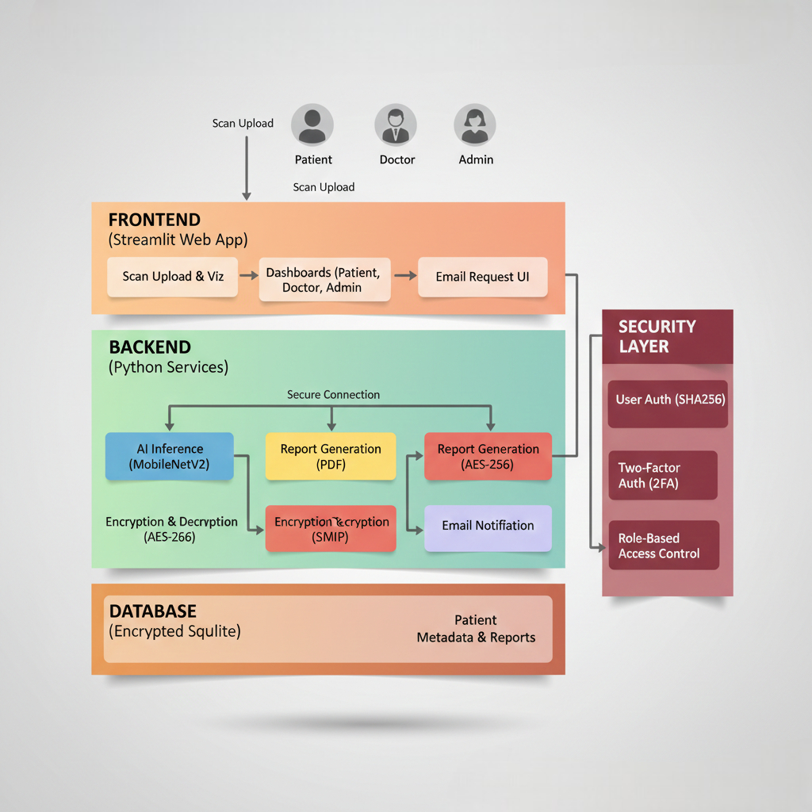
</div>

```
┌─────────────────────────────────────────────────────────────────────┐
│                    Next.js 14 Frontend  (Port 3001)                 │
│   Patient Portal │ Doctor Dashboard │ Pharmacist View │ Admin Panel  │
│      ChatBot Widget │ OTP Verification │ Drag-Drop Uploader          │
└──────────────────────────────┬──────────────────────────────────────┘
                               │ Axios REST API + JWT Bearer Token
                               ▼
┌─────────────────────────────────────────────────────────────────────┐
│                      FastAPI Backend  (Port 8000)                   │
│   /auth  /patient  /doctor  /pharmacist  /admin  /otp  /reports     │
│   /chatbot                                                          │
├─────────────────────────────────────────────────────────────────────┤
│  JWT Bearer Auth │ OTP Email 2FA │ RBAC Role Guard │ Bcrypt Hashing │
├───────────────┬───────────────────────┬─────────────────────────────┤
│ TensorFlow AI │  WeasyPrint + Jinja2  │   SMTP Email Service        │
│ MobileNetV2   │  PDF Report Template  │   Gmail STARTTLS            │
│ 6 Classes     │  Auto-Generated PDF   │   Patient Delivery          │
├───────────────┴───────────────────────┴─────────────────────────────┤
│          SQLAlchemy ORM → SQLite (dev) / PostgreSQL (prod)          │
│          Tables: users │ scans │ otp_records                        │
└─────────────────────────────────────────────────────────────────────┘
```

### 🧩 Component Summary

| Component | Technology | Responsibility |
|---|---|---|
| **Frontend SPA** | Next.js 14 + React 18 | Role-based dashboards, scan upload, report download |
| **REST API** | FastAPI (Python) | Endpoints, business logic, auth enforcement |
| **AI Inference** | TensorFlow 2.x / Keras | MobileNetV2 prediction, confidence scoring |
| **PDF Engine** | WeasyPrint + Jinja2 | Clinical diagnostic report rendering |
| **Auth Stack** | JWT + bcrypt + OTP | Stateless auth, password hashing, admin 2FA |
| **Database** | SQLAlchemy + SQLite | ORM, scan lifecycle, user accounts, OTP records |
| **Email Service** | smtplib + Gmail SMTP | OTP codes + PDF report delivery |
| **Chatbot** | Rule-based NLP | Keyword-matched medical FAQ assistant |

---

## 📂 Project Structure

<details>
<summary><b>📁 Click to expand full project tree</b></summary>

```
CLINICAL-SCAN-SUPPORT-SYSTEM/
│
├── .env                              # Environment configuration
├── requirements.txt                  # Python dependencies
├── README.md                         # This file
├── split_lung_dataset.py             # Dataset train/val/test splitter (70/15/15)
├── train_lung_model.py               # MobileNetV2 training with Grad-CAM
│
├── backend/                          # FastAPI REST API
│   ├── models/
│   │   ├── user.py                   # User (id, name, email, role, password)
│   │   ├── schema.py                 # Scan (id, patient_id, file_path, prediction, status...)
│   │   └── otp.py                    # OTPRecord (email, otp, expires_at, used)
│   │
│   ├── routers/
│   │   ├── auth_router.py            # POST /auth/register, /auth/login
│   │   ├── patient.py                # POST /patient/upload, GET /patient/status/{id}
│   │   ├── doctor.py                 # GET /doctor/pending, POST /doctor/analyze/{id}, /verify/{id}
│   │   ├── pharmacist.py             # GET /pharmacist/queue, POST /pharmacist/complete/{id}
│   │   ├── admin.py                  # GET /admin/pending, POST /admin/approve/{id}
│   │   ├── otp.py                    # POST /otp/send, /otp/verify
│   │   ├── chatbot.py                # POST /chatbot/
│   │   └── reports.py                # GET /reports/pdf/{scan_id}
│   │
│   ├── security/
│   │   ├── jwt_handler.py            # Token creation, verification, get_current_user
│   │   ├── password.py               # bcrypt hash / verify
│   │   └── role_guard.py             # require_role() dependency factory
│   │
│   ├── services/
│   │   ├── ai_service.py             # TensorFlow MobileNetV2 inference (predict_scan)
│   │   └── email_service.py          # SMTP: OTP email + PDF attachment delivery
│   │
│   ├── templates/
│   │   └── report_template.html      # Jinja2 HTML → WeasyPrint PDF
│   │
│   ├── config.py                     # BASE_DIR + UPLOAD_DIR path config
│   ├── database.py                   # SQLAlchemy engine + session + Base
│   ├── init_db.py                    # Create all DB tables
│   ├── main.py                       # FastAPI app + CORS + router registration
│   └── seed_db.py                    # Seed 4 demo users
│
├── frontend/                         # Next.js 14 SPA
│   ├── components/
│   │   ├── ChatBot.js                # Floating chatbot with category badges
│   │   ├── Navbar.js                 # Role-aware navigation bar
│   │   ├── ScanTable.js              # Reusable scan history table component
│   │   ├── UploadScan.js             # Drag-and-drop file uploader
│   │   ├── OTPVerification.js        # 6-digit OTP input with resend timer
│   │   ├── ProtectedRoute.js         # JWT-validated route guard
│   │   └── ReportDownloadButton.js   # Secure PDF fetch and open
│   │
│   ├── pages/
│   │   ├── index.js                  # Landing page
│   │   ├── login.js                  # Login + OTP flow
│   │   ├── register.js               # Registration page
│   │   ├── patient/index.js          # Patient dashboard
│   │   ├── doctor/index.js           # Doctor dashboard
│   │   ├── pharmacist/index.js       # Pharmacist dashboard
│   │   └── admin/index.js            # Admin dashboard
│   │
│   ├── services/api.js               # Axios client + auth interceptors
│   ├── styles/globals.css            # Dark theme global CSS
│   └── package.json
│
├── dataset/                          # Split dataset (created by split_lung_dataset.py)
│   └── lung/
│       ├── train/                    # 70% — 6 class folders
│       ├── val/                      # 15% — 6 class folders
│       └── test/                     # 15% — 6 class folders
│
├── Dataset/                          # Raw Kaggle dataset (input for splitter)
│   ├── COVID/
│   ├── Lung_Opacity/
│   ├── NIH_MERGED/
│   ├── Normal/
│   ├── Sick/
│   └── Viral_Pneumonia/
│
├── models/
│   ├── lung_model.h5                 # Trained MobileNetV2 weights (~14 MB)
│   ├── metadata/class_labels.json    # ["COVID","Lung_Opacity","NIH_MERGED","Normal","Sick","Viral_Pneumonia"]
│   ├── metrics/training_metrics.json # Train / val / test accuracy
│   └── plots/                        # Confusion matrix, training curves, Grad-CAM misclassifications
│
└── uploads/
    └── patient_scans/                # Uploaded scans stored as {UUID}.{ext}
```

</details>

---

## 🧠 AI Model & Pipeline

<div align="center">
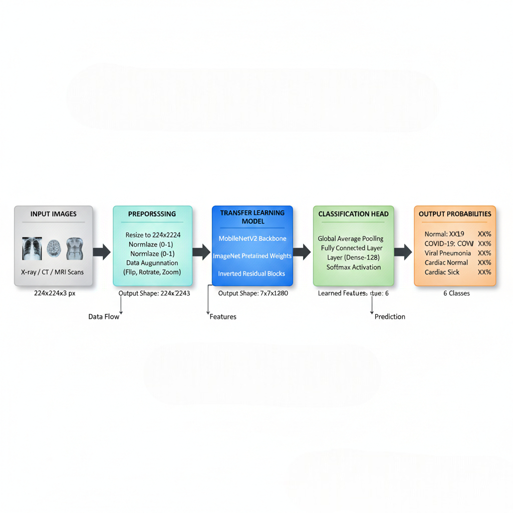
</div>

### 📊 Dataset

| Source | Classes | Images |
|---|---|---|
| NIH Chest X-ray Dataset | NIH_MERGED (14 pathologies combined) | 112,120 |
| COVID-19 Radiography Database | COVID · Normal · Lung_Opacity · Viral_Pneumonia | 42,330 |
| CAD Cardiac MRI Dataset | Normal · Sick | 63,425 |
| **Total** | **6 disease classes** | **217,875** |

### 🏛️ Model Architecture

```
Input Image (224 × 224 × 3)
         ↓
MobileNetV2 (ImageNet pretrained — feature extractor, frozen)
         ↓
GlobalAveragePooling2D
         ↓
Dense(256, activation='relu')
         ↓
Dropout(0.4)
         ↓
Dense(6, activation='softmax')   ← 6 disease classes
         ↓
Output: predicted_class + confidence_score + all_class_probabilities
```

### ⚙️ Training Configuration

```python
optimizer  = Adam(learning_rate=1e-4)
loss       = categorical_crossentropy
img_size   = (224, 224)
batch_size = 16
epochs     = 15
callbacks  = [
    EarlyStopping(monitor="val_loss", patience=5, restore_best_weights=True),
    ReduceLROnPlateau(monitor="val_loss", factor=0.5, patience=3)
]
```

### 📈 Performance Metrics

<div align="center">

&nbsp;&nbsp;
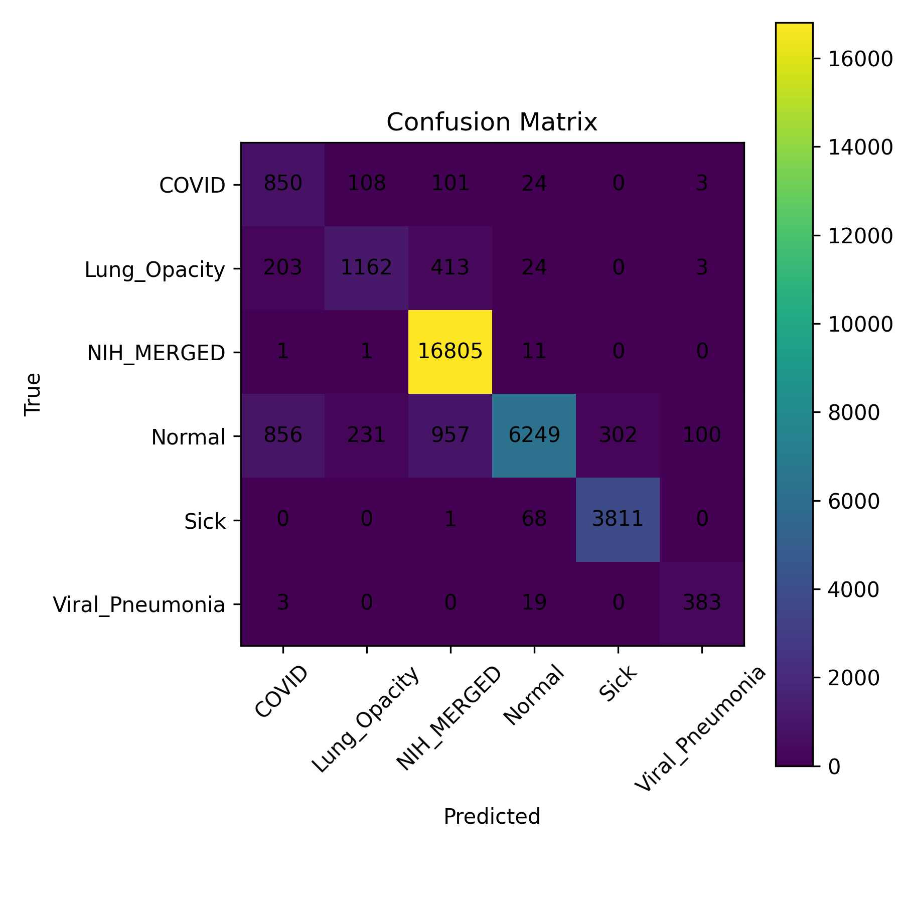
</div>

| Metric | Value |
|---|---|
| **Test Accuracy** | **89.51%** |
| Validation Accuracy | 89.31% |
| Training Accuracy | 92.97% |
| Total Training Images | 217,875 |
| Inference Speed | < 1 second |
| Model Size | ~14 MB (`.h5`) |
| Confidence Threshold | 75% (below → "Uncertain") |

**Predicted Disease Classes:**
`COVID` · `Lung_Opacity` · `NIH_MERGED` · `Normal` · `Sick` · `Viral_Pneumonia`

### 🔬 Inference Code (`backend/services/ai_service.py`)

<details>
<summary><b>View inference pipeline code</b></summary>

```python
def predict_scan(image_path: str) -> dict:
    img = cv2.imread(image_path, cv2.IMREAD_COLOR)
    img = cv2.cvtColor(img, cv2.COLOR_BGR2RGB)
    img = cv2.resize(img, (IMG_WIDTH, IMG_HEIGHT))   # auto-detected from model
    img = img.astype("float32") / 255.0
    img = np.expand_dims(img, axis=0)

    predictions   = model.predict(img, verbose=0)
    confidence    = float(np.max(predictions))
    class_index   = int(np.argmax(predictions))
    label         = CLASS_NAMES[class_index]

    if confidence < CONFIDENCE_THRESHOLD:   # default 0.75
        label = "Uncertain"

    return {
        "label":           label,
        "confidence":      confidence,
        "class_index":     class_index,
        "all_predictions": {CLASS_NAMES[i]: float(predictions[0][i])
                            for i in range(len(CLASS_NAMES))},
        "threshold_used":  CONFIDENCE_THRESHOLD,
    }
```

</details>

---

## 🎓 Model Training & Dataset Preparation

### Dataset Splitting (`split_lung_dataset.py`)

Prepares the raw Kaggle dataset for training by creating train/validation/test splits:

```python
# 70/15/15 split with sklearn train_test_split
SPLIT_RATIO = (0.7, 0.15, 0.15)   # train / val / test

# Preserves class folder structure for ImageDataGenerator
# Uses fixed random_state=42 for reproducibility
# Creates dataset/lung/train, dataset/lung/val, dataset/lung/test
```

**Usage:**
```bash
python split_lung_dataset.py
```

**Output Structure:**
```
dataset/lung/
├── train/
│   ├── COVID/           (70% of COVID images)
│   ├── Lung_Opacity/
│   ├── NIH_MERGED/
│   ├── Normal/
│   ├── Sick/
│   └── Viral_Pneumonia/
├── val/                 (15% of each class)
└── test/                (15% of each class)
```

### Model Training (`train_lung_model.py`)

Trains MobileNetV2 on the split dataset with transfer learning and Grad-CAM visualization:

<details>
<summary><b>View training pipeline features</b></summary>

**Key Features:**
- **Transfer Learning:** MobileNetV2 base (ImageNet weights, frozen)
- **Data Augmentation:** Rotation (10°), zoom (0.1), horizontal flip
- **Callbacks:** EarlyStopping (patience=3), ModelCheckpoint (saves best model)
- **Metrics Export:** Training curves, confusion matrix, classification report
- **Grad-CAM Visualization:** Heatmap overlay on top 9 misclassified images

**Training Code Snippet:**
```python
base_model = MobileNetV2(weights="imagenet", include_top=False, input_shape=(224,224,3))
base_model.trainable = False

x = base_model.output
x = GlobalAveragePooling2D()(x)
x = Dense(128, activation="relu")(x)
outputs = Dense(len(CLASS_NAMES), activation="softmax")(x)

model = Model(inputs=base_model.input, outputs=outputs)
model.compile(optimizer="adam", loss="categorical_crossentropy", metrics=["accuracy"])

callbacks = [
    EarlyStopping(patience=3, restore_best_weights=True),
    ModelCheckpoint("models/lung_model.h5", save_best_only=True)
]

history = model.fit(
    train_data, validation_data=val_data, epochs=15, callbacks=callbacks
)
```

**Generated Artifacts:**
- `models/lung_model.h5` — Trained model weights
- `models/metadata/class_labels.json` — Class index mapping
- `models/metrics/training_metrics.json` — Precision, recall, F1 per class
- `models/plots/training_graph.png` — Accuracy/loss curves
- `models/plots/confusion_matrix.png` — Per-class performance heatmap
- `models/plots/top_misclassified_gradcam.png` — Grad-CAM visualizations

</details>

**Usage:**
```bash
# After splitting dataset
python train_lung_model.py
```

**Training Environment:**
- GPU: NVIDIA GPU (CUDA-enabled) recommended for faster training
- RAM: 16GB+ recommended
- Training Time: ~15 minutes on RTX 3060 (depends on GPU)

---

## 🔄 Clinical Workflow

<div align="center">
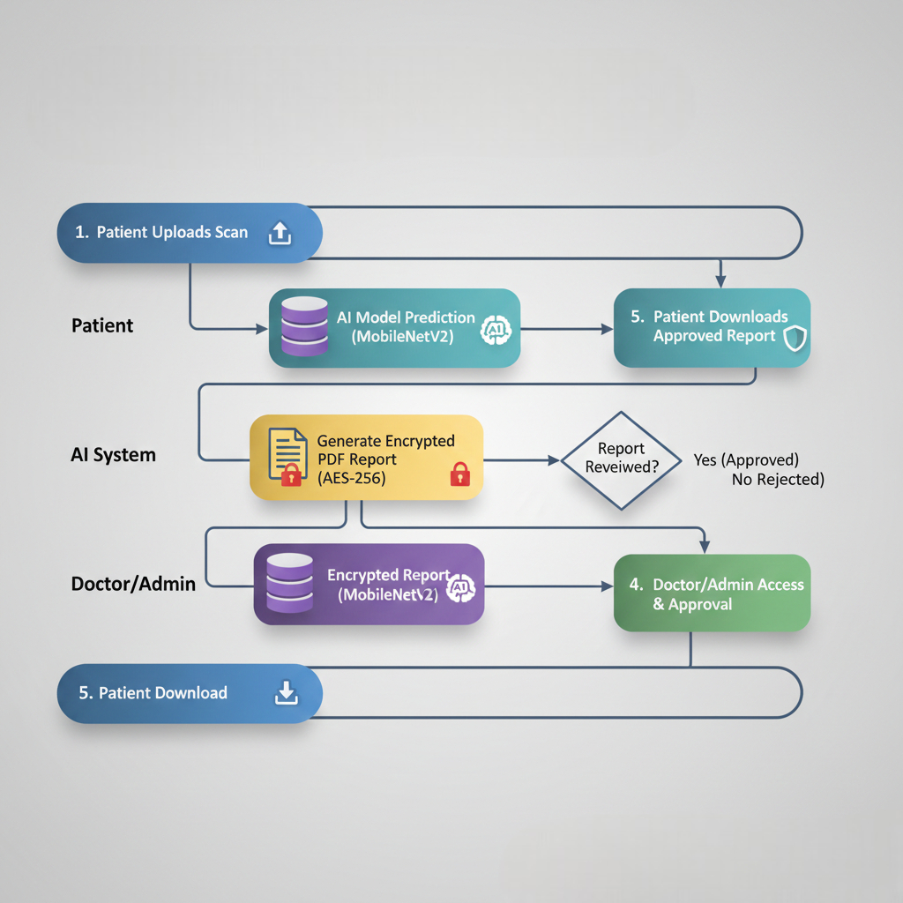
</div>

The scan lifecycle moves through **5 statuses**, each requiring a different authenticated role:

```
┌──────────┐     ┌────────────────┐     ┌─────────────────┐     ┌───────────────────────┐     ┌──────────────┐
│ PATIENT  │     │    DOCTOR      │     │     DOCTOR      │     │      PHARMACIST       │     │    ADMIN     │
│ uploads  │────▶│  runs AI scan  │────▶│ adds clinical   │────▶│  adds prescription    │────▶│  approves +  │
│  image   │     │                │     │     notes       │     │        notes          │     │  emails PDF  │
└──────────┘     └────────────────┘     └─────────────────┘     └───────────────────────┘     └──────────────┘
PENDING_AI    →    AI_ANALYZED      →    DOCTOR_VERIFIED     →    PHARMACIST_COMPLETED     →    REPORT_READY
```

| Status | Meaning |
|---|---|
| `PENDING_AI` | Scan uploaded, awaiting AI analysis |
| `AI_ANALYZED` | MobileNetV2 prediction complete with confidence score |
| `DOCTOR_VERIFIED` | Doctor reviewed AI results and added clinical notes |
| `PHARMACIST_COMPLETED` | Pharmacist reviewed and added prescription notes |
| `REPORT_READY` | Admin approved — PDF auto-generated and emailed to patient |

---

## 🎛️ Role Dashboards

<details>
<summary><b>👤 Patient Dashboard</b></summary>

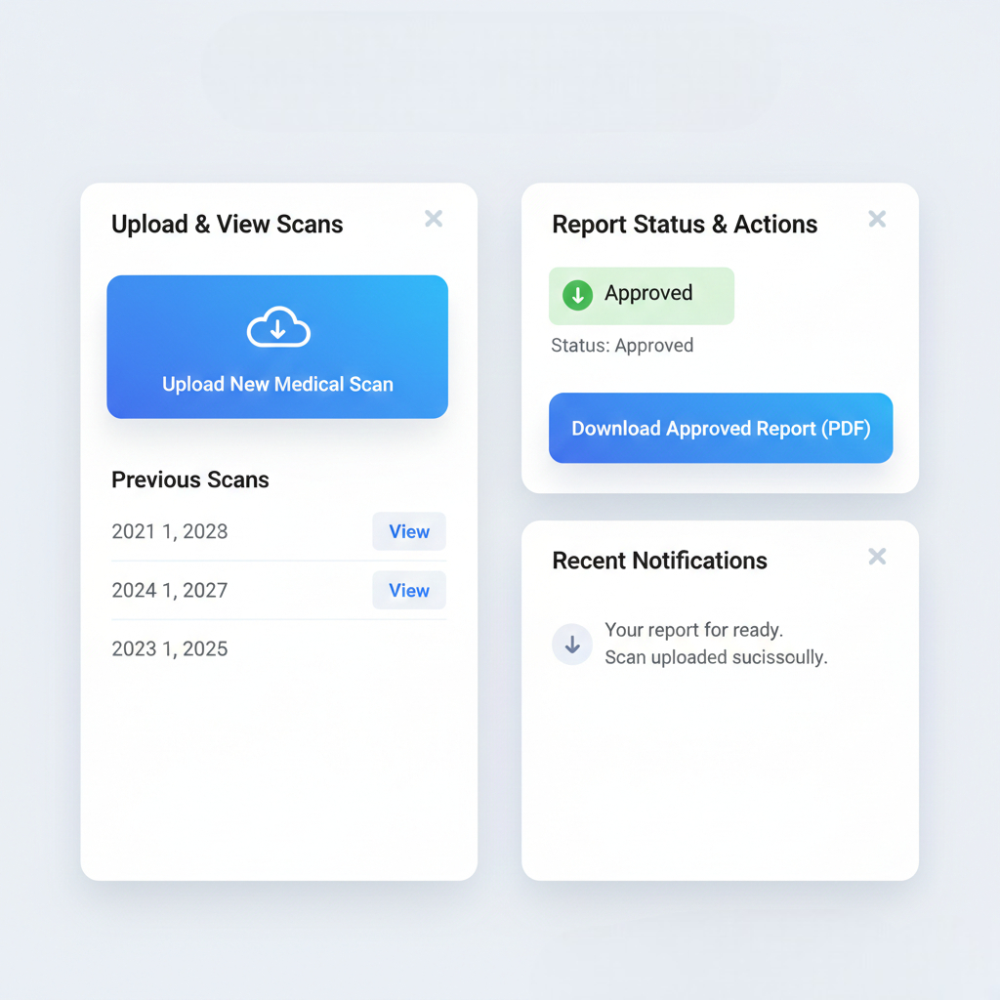

- Upload scan images via drag-and-drop with real-time progress bar
- View full scan history with status badges, AI predictions, and confidence scores
- See doctor clinical notes and pharmacist prescription notes per scan
- Download approved diagnostic PDF reports directly from the dashboard

</details>

<details>
<summary><b>🩺 Doctor Dashboard</b></summary>

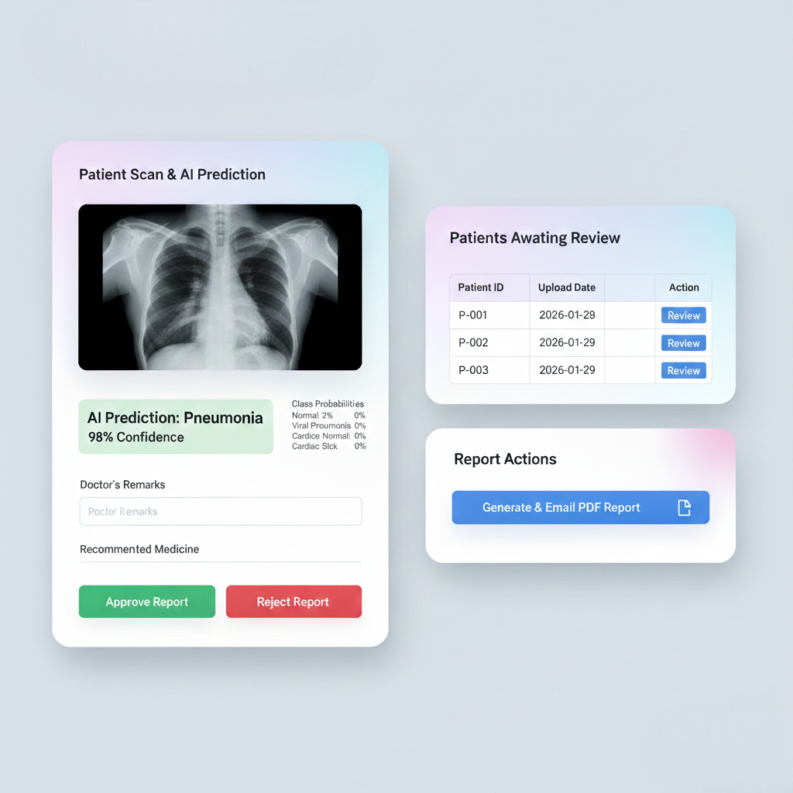

- View all patient scans in the work queue
- Trigger AI analysis on any scan with one click — MobileNetV2 runs and returns prediction + confidence
- Review AI prediction and add mandatory clinical verification notes
- Advance scan to `DOCTOR_VERIFIED` status for pharmacist review

</details>

<details>
<summary><b>💊 Pharmacist Dashboard</b></summary>

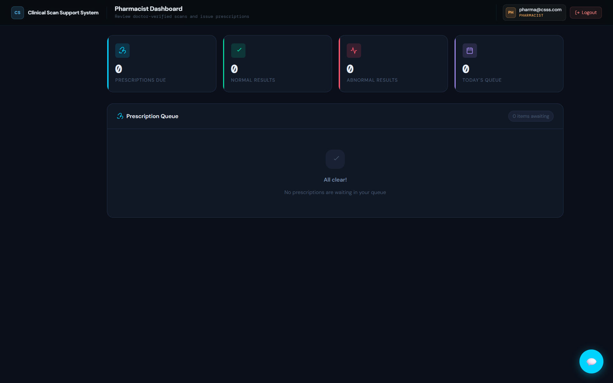

- View all `DOCTOR_VERIFIED` scans in the prescription queue
- Review AI prediction, confidence score, and doctor clinical notes
- Use quick-fill prescription templates or write custom medication notes
- Mark scan `PHARMACIST_COMPLETED` to route to admin for final approval

</details>

<details>
<summary><b>🛡️ Admin Dashboard</b></summary>

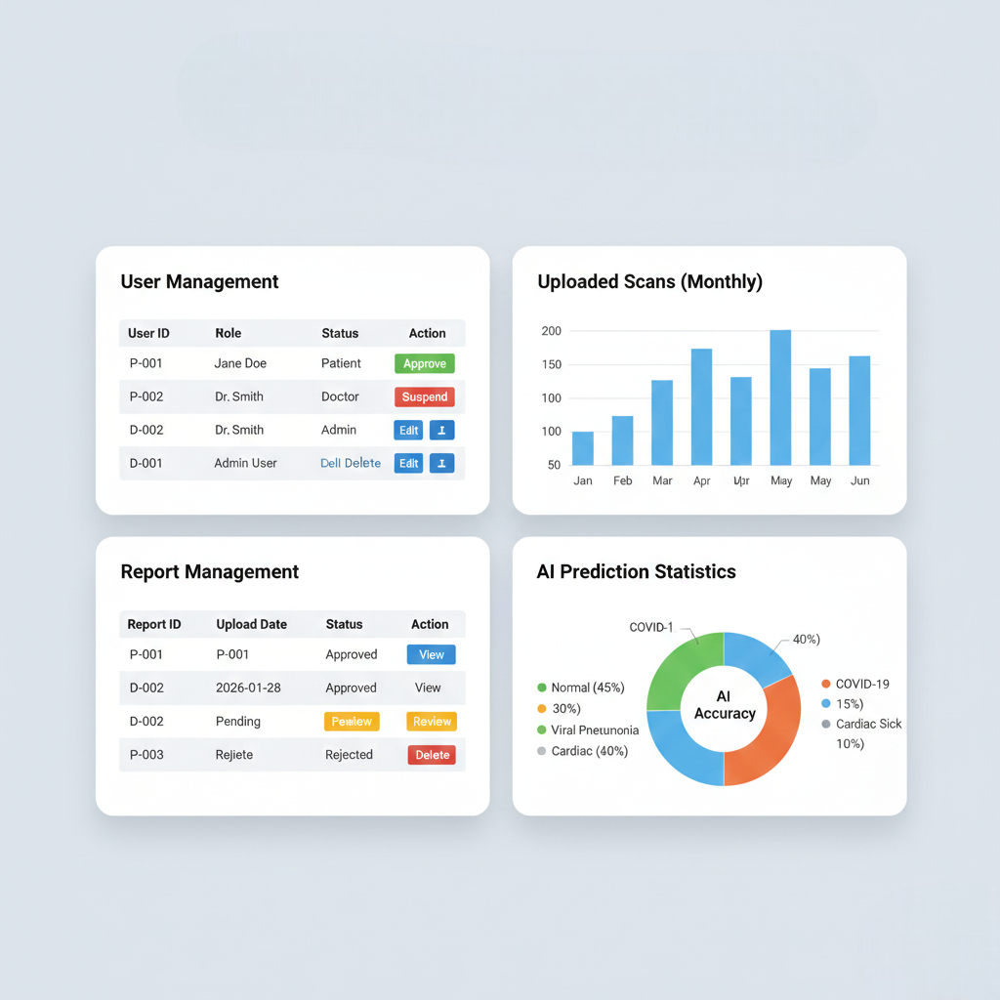

- Secure login with OTP two-factor authentication via email
- View all scans in `PHARMACIST_COMPLETED` status awaiting approval
- Approve any scan — triggers instant PDF generation + patient email delivery
- Full scan details: AI prediction, doctor notes, pharmacist prescription, risk level

</details>

<details>
<summary><b>💬 CSSS Medical Chatbot</b></summary>

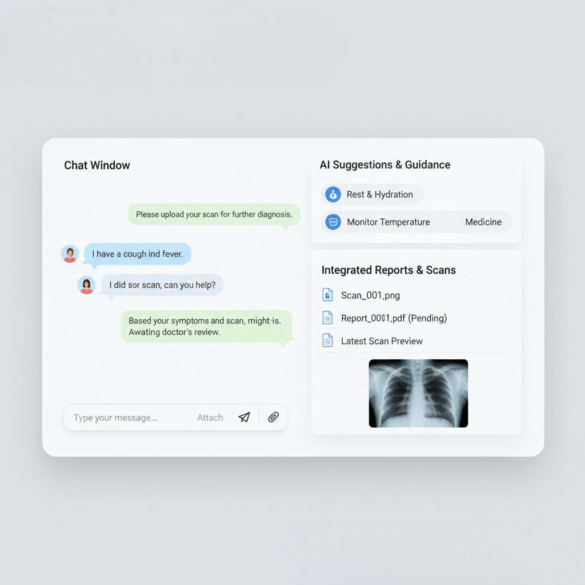

- Floating chatbot widget available on all dashboards
- Keyword-matching responses across 10 categories: Medical, Workflow, AI, Auth, Scan, Result, Support, Admin, Greeting, Fallback
- Color-coded category badges on every bot response
- Chat history persisted locally, clear chat support, typing indicator animation

</details>

---

## 🔌 API Endpoints

Full interactive docs at `http://localhost:8000/docs` (Swagger UI) after starting the server.

### Authentication `/auth`

| Method | Endpoint | Description |
|---|---|---|
| `POST` | `/auth/register` | Register new user (`name`, `email`, `password`, `role`) |
| `POST` | `/auth/login` | Login → JWT token (admin requires OTP step) |

### OTP `/otp`

| Method | Endpoint | Description |
|---|---|---|
| `POST` | `/otp/send` | Send 6-digit OTP to admin email (10-min expiry) |
| `POST` | `/otp/verify` | Verify OTP code → returns full access JWT |

### Patient `/patient`

| Method | Endpoint | Description |
|---|---|---|
| `POST` | `/patient/upload` | Upload scan image (JPG/PNG, multipart, max 10MB) |
| `GET` | `/patient/status/{patient_id}` | Get all scans for this patient |

### Doctor `/doctor`

| Method | Endpoint | Description |
|---|---|---|
| `GET` | `/doctor/pending` | All scans in work queue |
| `POST` | `/doctor/analyze/{scan_id}` | Run MobileNetV2 inference on scan |
| `POST` | `/doctor/verify/{scan_id}` | Add clinical notes → status: `DOCTOR_VERIFIED` |

### Pharmacist `/pharmacist`

| Method | Endpoint | Description |
|---|---|---|
| `GET` | `/pharmacist/queue` | Scans in `DOCTOR_VERIFIED` status |
| `POST` | `/pharmacist/complete/{scan_id}` | Add prescription → status: `PHARMACIST_COMPLETED` |

### Admin `/admin`

| Method | Endpoint | Description |
|---|---|---|
| `GET` | `/admin/pending` | Scans awaiting final approval |
| `POST` | `/admin/approve/{scan_id}` | Generate PDF + email patient + `REPORT_READY` |

### Reports `/reports`

| Method | Endpoint | Description |
|---|---|---|
| `GET` | `/reports/pdf/{scan_id}` | Download diagnostic PDF (JWT protected, role scoped) |

### Chatbot `/chatbot`

| Method | Endpoint | Description |
|---|---|---|
| `POST` | `/chatbot/` | Send message → keyword-matched medical response + category |

---

## 🔒 Security Architecture

<div align="center">
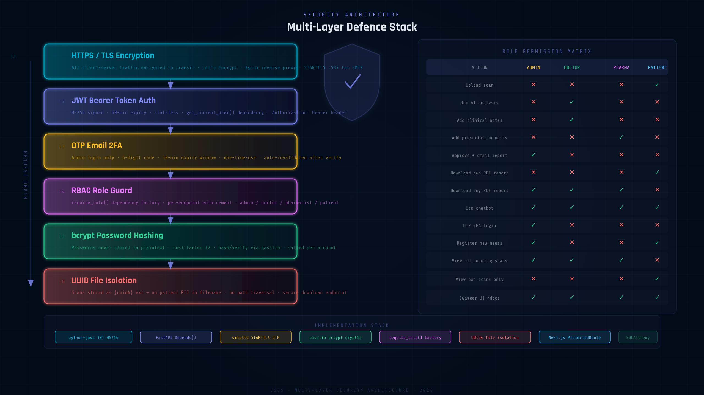
</div>

```
HTTPS / TLS (Production Transport)
             ↓
JWT Bearer Token   (HS256, 60-min expiry, fetches full user from DB)
             ↓
OTP Email 2FA      (Admin login only — 6-digit, 10-min window, auto-invalidated)
             ↓
RBAC Role Guard    (per-endpoint enforcement — admin / doctor / pharmacist / patient)
             ↓
bcrypt Hashing     (passwords never stored in plain text)
             ↓
UUID File Names    (scan files stored as {uuid}.ext — no patient PII in filename)
```

### 🔐 Role Permission Matrix

| Permission | Admin | Doctor | Pharmacist | Patient |
|---|:---:|:---:|:---:|:---:|
| Upload scan | ❌ | ❌ | ❌ | ✅ |
| Run AI analysis | ❌ | ✅ | ❌ | ❌ |
| Add clinical notes | ❌ | ✅ | ❌ | ❌ |
| Add prescription notes | ❌ | ❌ | ✅ | ❌ |
| Approve & email report | ✅ | ❌ | ❌ | ❌ |
| Download own PDF report | ❌ | ❌ | ❌ | ✅ |
| Download any PDF report | ✅ | ✅ | ✅ | ❌ |
| Use chatbot | ✅ | ✅ | ✅ | ✅ |
| OTP 2FA login | ✅ | ❌ | ❌ | ❌ |

---

## 🛠️ Installation & Setup

### Prerequisites

- Python 3.10+
- Node.js 18.17+ and npm 9+
- Git
- (Optional) NVIDIA GPU with CUDA for model training

### 1. Clone the Repository

```bash
git clone https://github.com/Darkwebnew/Projectwork2.git
cd Projectwork2
```

### 2. Backend Setup (FastAPI)

```bash
# Install Python dependencies
pip install -r requirements.txt

# Configure environment variables
cp .env.example .env
# Edit .env with your SMTP credentials and JWT secret

# Initialize the database
python backend/init_db.py

# Seed 4 demo users
python backend/seed_db.py

# Start the FastAPI server
uvicorn backend.main:app --reload --host 0.0.0.0 --port 8000
```

API: `http://localhost:8000` · Swagger UI: `http://localhost:8000/docs`

### 3. Frontend Setup (Next.js)

```bash
cd frontend
npm install
npm run dev
```

Frontend: `http://localhost:3001`

### 4. Environment Variables

```env
# ── Database ──────────────────────────────────────
DATABASE_URL=sqlite:///database/csss.db

# ── JWT Security ──────────────────────────────────
JWT_SECRET_KEY=your_secret_key_here
JWT_ALGORITHM=HS256
JWT_ACCESS_TOKEN_EXPIRE_MINUTES=60

# ── SMTP (Gmail App Password) ─────────────────────
SMTP_HOST=smtp.gmail.com
SMTP_PORT=587
SMTP_USER=your_email@gmail.com
SMTP_PASSWORD=your_16char_app_password
EMAIL_SENDER=your_email@gmail.com

# ── AI Model ──────────────────────────────────────
AI_MODEL_PATH=models/lung_model.h5
CLASS_LABELS_PATH=models/metadata/class_labels.json
CONFIDENCE_THRESHOLD=0.75
IMG_SIZE=224

# ── Storage ───────────────────────────────────────
UPLOAD_DIR=uploads/patient_scans
REPORTS_DIR=reports/temp

# ── Frontend ──────────────────────────────────────
NEXT_PUBLIC_API_URL=http://localhost:8000
FRONTEND_URL=http://localhost:3001
```

> **Gmail SMTP Note:** Enable 2FA on your Google account → Google Account → Security → App Passwords → generate 16-character password. Use that as `SMTP_PASSWORD`.

### 5. (Optional) Retrain the Model

If you want to retrain the model with your own dataset:

```bash
# Step 1: Split dataset
python split_lung_dataset.py

# Step 2: Train model (requires GPU for faster training)
python train_lung_model.py

# Trained model will be saved to models/lung_model.h5
```

---

## 🚀 Quick Start

### Demo Accounts (after `seed_db.py`)

| Role | Email | Password |
|---|---|---|
| Admin | `admin@csss.com` | `Admin123` |
| Doctor | `doctor@csss.com` | `Doctor123` |
| Pharmacist | `pharma@csss.com` | `Pharma123` |
| Patient | `patient@csss.com` | `Patient123` |

> 💡 The login page includes clickable test account buttons that auto-fill credentials.

---

## 🧪 End-to-End Workflow Demo

```
Step 1 ── PATIENT logs in
          → Clicks "Upload Scan"
          → Drags a chest X-ray JPG into the upload zone
          → Real-time progress bar shows upload completion
          → Scan appears in history as "Pending AI"

Step 2 ── DOCTOR logs in
          → Sees the scan in the work queue
          → Clicks "Analyze" → MobileNetV2 runs inference
          → Prediction (e.g. "COVID") + confidence score displayed
          → Doctor adds clinical notes → clicks "Verify"
          → Status updates to "Doctor Verified"

Step 3 ── PHARMACIST logs in
          → Sees scan in prescription queue
          → Reviews AI prediction, confidence, and doctor notes
          → Selects quick template or writes custom prescription
          → Clicks "Complete" → status: "Pharmacist Completed"

Step 4 ── ADMIN logs in (OTP email verification required)
          → Sees scan in pending approvals list
          → Reviews full scan details
          → Clicks "Approve"
          → PDF auto-generated (WeasyPrint + Jinja2 template)
          → PDF emailed to patient automatically in background

Step 5 ── PATIENT
          → Receives email with professional PDF report attached
          → Can also download directly from Patient Dashboard
          → Report contains: scan image, AI prediction, confidence score,
            risk level, doctor findings, prescription, and 3-party signatures
```

---

## 📄 Generated PDF Report

The auto-generated diagnostic report includes:

- 🏥 **Hospital header** — clinic name, report ID, generation timestamp
- 👤 **Patient information** — name, ID, age, gender, contact details
- 🩻 **Scan information** — scan type, date, machine, contrast, quality
- 🤖 **AI Analysis Results** — model, version, prediction badge, confidence %, risk level
- 📝 **Clinical Findings** — doctor verification notes
- 💊 **Prescription** — pharmacist medication notes
- 🖼️ **Scan Image** — original scan embedded as base64
- ✍️ **Signatures** — Radiologist, Pharmacist, and AI System signature blocks
- ⚠️ **AI Notice** — professional disclaimer watermark

---

## 💬 CSSS Medical Chatbot

The built-in CSSS Medical Assistant is a **keyword-matching chatbot** (not an LLM). It handles common questions across 10 categories:

| Category | Topics Covered |
|---|---|
| 🩺 Medical | CT, MRI, X-ray scan type information |
| 🔄 Workflow | Patient → Doctor → Pharmacist → Admin pipeline |
| 🤖 AI | What predictions mean, confidence scores, uncertainty |
| 🔓 Auth | Login, OTP, registration, password requirements |
| 🖼️ Scan | Upload formats, file size limits, accepted types |
| 📊 Result | How to read and understand your diagnostic report |
| 📞 Support | Contact, feedback, troubleshooting |
| 🔑 Admin | Admin OTP process explanation |
| 👋 Greeting | Welcome and general help |
| ❓ Fallback | Topic list when query is not recognized |

---

## 🗺️ Roadmap

### v2.0 — Q3 2026
- [ ] PostgreSQL migration for production scale
- [ ] Docker Compose full-stack deployment
- [ ] WhatsApp report delivery via Twilio (already configured in `.env`)
- [ ] DICOM file format support
- [ ] Grad-CAM heatmap overlays in PDF reports for explainable AI

### v2.5 — Q4 2026
- [ ] Mobile-responsive PWA frontend
- [ ] Real-time scan status push notifications (WebSocket)
- [ ] Multi-language PDF reports (English, Tamil, Hindi)
- [ ] EMR / EHR system integration (HL7 FHIR)
- [ ] Federated learning across hospital nodes
- [ ] Audit logging for HIPAA compliance

---

## 👥 Team

| | Name | Role | GitHub |
|---|---|---|---|
|  | **Sriram V** | Lead Developer & AI/ML Engineer | [@Darkwebnew](https://github.com/Darkwebnew) |
|  | **Surothaaman R** | Backend Development & Security | [@surothaaman](https://github.com/surothaaman) |
|  | **V. S. Andrew Varghese** | Frontend Development | [@Andrewvarghese653](https://github.com/Andrewvarghese653) |
|  | **Praveen CK** | Database & Testing | [@praveenck23009864](https://github.com/praveenck23009864) |
|  | **Dr. Swedha V** | Medical Domain Expertise | [@swedha333](https://github.com/swedha333) |
|  | **Dr. Selvakumar R** | AI/ML Advisor | [@selvasachein](https://github.com/selvasachein) |

---

## 🙏 Acknowledgements

**Datasets (Kaggle)**
- NIH Clinical Center — Chest X-Ray8 Dataset (112,120 images)
- Tawsifur Rahman et al. — COVID-19 Radiography Database (42,330 images)
- CAD Cardiac MRI Dataset (63,425 images)

**Core Libraries**
- [FastAPI](https://fastapi.tiangolo.com/) — High-performance Python REST API
- [Next.js](https://nextjs.org/) — React framework with file-based routing
- [TensorFlow / Keras](https://www.tensorflow.org/) — Deep learning inference
- [WeasyPrint](https://weasyprint.org/) — HTML → PDF report generation
- [SQLAlchemy](https://www.sqlalchemy.org/) — Python ORM
- [python-jose](https://github.com/mpdavis/python-jose) — JWT implementation
- [Axios](https://axios-http.com/) — HTTP client for frontend API calls

**Academic References**
- Howard et al., "MobileNets: Efficient CNNs for Mobile Vision Applications" (2017)
- Sandler et al., "MobileNetV2: Inverted Residuals and Linear Bottlenecks" (2018)
- Selvaraju et al., "Grad-CAM: Visual Explanations from Deep Networks" (2017)
- Wang et al., "ChestX-ray8: Hospital-scale Chest X-ray Database and Benchmarks" (2017)
- Chowdhury et al., "Can AI Help in Screening Viral and COVID-19 Pneumonia?" *IEEE Access* (2020)

---

## 📄 License

This project is **proprietary software**. All rights reserved © 2026.

> ⚠️ Unauthorized copying, distribution, or use of this software is strictly prohibited under the **Indian Copyright Act, 1957**. See [`LICENSE.txt`](LICENSE.txt) for full terms.

---

## 📞 Contact & Support

| Channel | Link |
|---|---|
| 📧 Email | sriramnvks@gmail.com |
| 🐛 Bug Reports | [GitHub Issues](https://github.com/Darkwebnew/Projectwork2/issues) |
| 💬 Discussions | [GitHub Discussions](https://github.com/Darkwebnew/Projectwork2/discussions) |
| 📖 API Docs | `http://localhost:8000/docs` (Swagger UI) |

---

<div align="center">

*Built with ❤️ for better healthcare diagnostics — Tamil Nadu, India 🇮🇳*

**⭐ Star this repository if CSSS helped your project!**

</div>
