<div align="center">


[](https://git.io/typing-svg)

<br/>

[](https://www.python.org/)
[](https://fastapi.tiangolo.com/)
[](https://nextjs.org/)
[](https://www.tensorflow.org/)
[](https://sqlite.org/)
[]()

<br/>

[](models/metrics/training_metrics.json)
[]()
[](documents/)
[](LICENSE.txt)
[]()

<br/>

> **⚕️ From scan upload → MobileNetV2 AI inference → 4-role clinical review → encrypted PDF report delivery — fully automated in one platform.**

<br/>

> **Medical Disclaimer:** CSSS is an AI-assisted screening tool designed to **support** qualified medical professionals. All AI predictions require review by a licensed physician before any clinical decision is made.

<br/>

[🚀 Quick Start](#-quick-start) &nbsp;•&nbsp; [🏗️ Architecture](#%EF%B8%8F-system-architecture) &nbsp;•&nbsp; [🧠 AI Pipeline](#-ai-model--pipeline) &nbsp;•&nbsp; [📸 Screenshots](#%EF%B8%8F-ui-walkthrough) &nbsp;•&nbsp; [🔌 API](#-api-endpoints) &nbsp;•&nbsp; [👥 Team](#-team) &nbsp;•&nbsp; [☕ Support](#-support-the-project)

</div>

---

<div align="center">

## 🏆 Why CSSS?

</div>

```
Traditional Diagnostics   →   Manual review, paper reports, siloed roles, slow turnaround
CSSS                      →   AI pre-screening, automated PDF reports, unified 4-role platform
```

<table align="center">
<tr>
<td align="center" width="200">

<br/><b>89.51% Accuracy</b>
<br/><sub>MobileNetV2 on 217,875 medical images across 6 disease classes</sub>
</td>
<td align="center" width="200">

<br/><b>4-Role Workflow</b>
<br/><sub>Patient → Doctor → Pharmacist → Admin clinical pipeline</sub>
</td>
<td align="center" width="200">

<br/><b>Auto PDF Reports</b>
<br/><sub>WeasyPrint + Jinja2 professional diagnostic reports emailed automatically</sub>
</td>
<td align="center" width="200">

<br/><b>Enterprise Security</b>
<br/><sub>JWT + bcrypt + OTP 2FA with full role-based access control</sub>
</td>
</tr>
</table>

---

## 🌟 Project Overview

**Clinical Scan Support System (CSSS)** is a production-grade, full-stack AI medical imaging platform built as a Final Year Project at **Saveetha Engineering College**. It automates the complete diagnostic pipeline — from patient scan upload through real-time MobileNetV2 inference, structured multi-role clinical review, to professional PDF diagnostic report generation and encrypted email delivery.

> 🎓 **Academic Supervisor:** Ms. V. Swedha & Dr. Selvakumar R, Saveetha Engineering College
> 📅 **Academic Year:** 2024–2025
> 📰 **Research:** Published in IEEE Conference & Journal
> 🏛️ **Institution:** Saveetha Engineering College, Chennai

### 🎯 Problem Statement

Traditional diagnostic workflows are manual, siloed, and slow — patients wait days for reports that require multiple sign-offs across departments with no unified tracking. CSSS replaces this with a single platform where every stakeholder — patient, doctor, pharmacist, and admin — has a purpose-built dashboard, enforced RBAC, and a clearly defined role in an automated pipeline that ends with an encrypted PDF report in the patient's inbox.

---

## ✨ Feature Highlights

<details>
<summary><b>🧠 AI Inference Engine — MobileNetV2</b></summary>

- Trained on **217,875 medical images** across 6 disease classes
- **89.51% test accuracy** with sub-second inference speed
- Confidence scoring — below 75% threshold flags as "Uncertain"
- Per-class probability output for all 6 disease categories
- Transfer learning from ImageNet with custom classification head
- **Grad-CAM visualization** — heatmap overlays on misclassified images
- Incremental retraining supported via `train_lung_model.py`

</details>

<details>
<summary><b>🔄 4-Role Clinical Workflow Pipeline</b></summary>

- **Patient** — Drag-and-drop scan upload, real-time status tracking, PDF download
- **Doctor** — AI analysis trigger, clinical note entry, verification workflow
- **Pharmacist** — Prescription management with quick-fill templates
- **Admin** — Final approval, PDF generation, encrypted email delivery to patient
- Every role has an isolated dashboard — no cross-role data leakage

</details>

<details>
<summary><b>📄 Auto PDF Report Generation</b></summary>

- WeasyPrint + Jinja2 HTML template rendering
- Includes: scan image, AI prediction, confidence %, risk level, doctor findings, prescription, 3-party signatures, AI disclaimer watermark
- Automatically emailed as attachment on Admin approval
- Also available for direct download from Patient Dashboard

</details>

<details>
<summary><b>🔒 Enterprise Security Stack</b></summary>

- **JWT Bearer tokens** — stateless authentication
- **bcrypt password hashing** — salted one-way encryption
- **OTP 2FA** — Admin-only 6-digit email verification (10-min expiry, one-time-use)
- **Role guard middleware** — `require_role()` dependency factory on every protected route
- **UUID file storage** — scan filenames never expose patient identity

</details>

<details>
<summary><b>💬 CSSS Medical Chatbot</b></summary>

- Keyword-matched assistant across 10 medical and system categories
- Covers: scan types, workflow guidance, AI result interpretation, OTP help, upload formats
- Floating widget available on all dashboards
- Chat history persistence with typing animation

</details>

<details>
<summary><b>📊 Full Observability & Model Metrics</b></summary>

- Training curves, confusion matrix, Grad-CAM plots auto-generated
- `training_metrics.json` — precision, recall, F1 per class
- Real-time scan status badges across all dashboards
- Swagger UI auto-documentation at `/docs`

</details>

---

## 🏗️ System Architecture

<div align="center">


*End-to-end system: Next.js frontend → FastAPI → MobileNetV2 → PDF → SMTP delivery*

</div>

### 🧩 Component Summary

| Component | Technology | Responsibility |
|-----------|-----------|---------------|
| **Frontend SPA** | Next.js 14 + React 18 | Role dashboards, scan upload, report download |
| **REST API** | FastAPI (Python) | Endpoints, business logic, auth enforcement |
| **AI Inference** | TensorFlow 2.x / Keras | MobileNetV2 prediction + confidence scoring |
| **PDF Engine** | WeasyPrint + Jinja2 | Clinical diagnostic report rendering |
| **Auth Stack** | JWT + bcrypt + OTP | Stateless auth, password hashing, admin 2FA |
| **Database** | SQLAlchemy + SQLite | ORM, scan lifecycle, users, OTP records |
| **Email Service** | smtplib + Gmail SMTP | OTP delivery + encrypted PDF attachment |
| **Chatbot** | Rule-based NLP | Keyword-matched medical FAQ assistant |

### 🔄 Request Processing Flow

```
                    ┌──────────────────────┐
                    │   Patient Uploads     │
                    │   Chest X-Ray / MRI  │
                    └──────────┬───────────┘
                               │
                    ┌──────────▼───────────┐
                    │  FastAPI REST API     │  ◄── JWT Auth + Role Guard
                    │  Port 8000           │
                    └──────────┬───────────┘
                               │
               ┌───────────────▼────────────────┐
               │        AI Inference Engine      │
               │  MobileNetV2 (224×224×3 input) │
               │  → 6-class softmax output       │
               │  → Confidence score + label     │
               └───────────────┬────────────────┘
                               │
          ┌────────────────────▼─────────────────────┐
          │           4-Role Clinical Pipeline        │
          │  Doctor Review → Pharmacist → Admin OK   │
          └────────────────────┬─────────────────────┘
                               │
                    ┌──────────▼───────────┐
                    │  WeasyPrint + Jinja2 │  ◄── PDF generation
                    │  PDF Report Engine   │
                    └──────────┬───────────┘
                               │
                    ┌──────────▼───────────┐
                    │  Gmail SMTP Service  │  ◄── Encrypted email delivery
                    │  → Patient Inbox     │
                    └──────────────────────┘
```

---

## 🧠 AI Model & Pipeline

<div align="center">


</div>

### 📊 Dataset

| Source | Classes | Images |
|--------|---------|--------|
| NIH Chest X-ray Dataset | NIH_MERGED (14 pathologies) | 112,120 |
| COVID-19 Radiography Database | COVID · Normal · Lung_Opacity · Viral_Pneumonia | 42,330 |
| CAD Cardiac MRI Dataset | Normal · Sick | 63,425 |
| **Total** | **6 disease classes** | **217,875** |

### 🏛️ MobileNetV2 Architecture

```
Input (224 × 224 × 3)
        ↓
MobileNetV2 — ImageNet pretrained (frozen feature extractor)
        ↓
GlobalAveragePooling2D
        ↓
Dense(256, relu)
        ↓
Dropout(0.4)
        ↓
Dense(6, softmax)  ← COVID · Lung_Opacity · NIH_MERGED · Normal · Sick · Viral_Pneumonia
        ↓
predicted_class + confidence_score + all_class_probabilities
```

### ⚙️ Training Configuration

```python
optimizer  = Adam(learning_rate=1e-4)
loss       = categorical_crossentropy
img_size   = (224, 224)
batch_size = 16
epochs     = 15
callbacks  = [
    EarlyStopping(monitor="val_loss", patience=5, restore_best_weights=True),
    ReduceLROnPlateau(monitor="val_loss", factor=0.5, patience=3)
]
split      = 70% train / 15% val / 15% test
```

### 📈 Performance Metrics

| Metric | Value |
|--------|-------|
| **Test Accuracy** | **89.51%** ✅ |
| Validation Accuracy | 89.31% |
| Training Accuracy | 92.97% |
| Inference Speed | < 1 second |
| Model Size | ~14 MB (.h5) |
| Confidence Threshold | 75% (below → "Uncertain") |

<div align="center">

| Training Curve | Confusion Matrix |
|---------------|-----------------|
|  |  |

</div>

### 🔬 Grad-CAM Visualization

<div align="center">

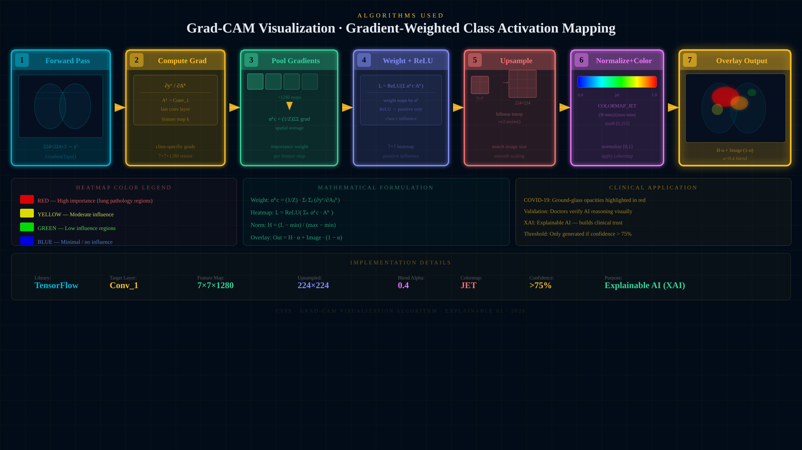

*Grad-CAM heatmaps showing which regions of the scan the model focuses on for each prediction*

</div>

---

## 🖥️ UI Walkthrough

<div align="center">

### 🔑 Auth Flow

| Login | Register | Report Email Received (Auto-Generated PDF) |
|-------|----------|----------------------|
|  | 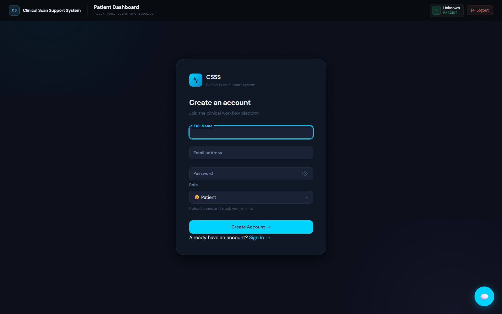 |  |

### 👤 Patient

| Patient Dashboard | Scan Upload Interface |
|------------------|----------------------|
|  |  |

### 🩺 Clinical Staff

| Doctor Dashboard | Pharmacist Dashboard | Admin Dashboard |
|-----------------|---------------------|-----------------|
|  |  |  |

### 💬 AI Chatbot

| Chatbot Interface |
|------------------|
|  |

</div>

---

## 📂 Project Structure

<details>
<summary><b>📁 Click to expand full project tree</b></summary>

```plaintext
Projectwork2/
│
├── backend/                          # FastAPI REST API
│   ├── models/
│   │   ├── user.py                   # User (id, name, email, role, password)
│   │   ├── schema.py                 # Scan (id, patient_id, prediction, status...)
│   │   └── otp.py                    # OTPRecord (email, otp, expires_at, used)
│   │
│   ├── routers/
│   │   ├── auth_router.py            # POST /auth/register, /auth/login
│   │   ├── patient.py                # POST /patient/upload, GET /patient/status/{id}
│   │   ├── doctor.py                 # GET /doctor/pending, POST /doctor/analyze/{id}
│   │   ├── pharmacist.py             # GET /pharmacist/queue, POST /pharmacist/complete/{id}
│   │   ├── admin.py                  # GET /admin/pending, POST /admin/approve/{id}
│   │   ├── otp.py                    # POST /otp/send, /otp/verify
│   │   ├── chatbot.py                # POST /chatbot/
│   │   └── reports.py                # GET /reports/pdf/{scan_id}
│   │
│   ├── security/
│   │   ├── jwt_handler.py            # Token creation + verification
│   │   ├── password.py               # bcrypt hash / verify
│   │   └── role_guard.py             # require_role() dependency factory
│   │
│   ├── services/
│   │   ├── ai_service.py             # TensorFlow MobileNetV2 inference
│   │   └── email_service.py          # SMTP: OTP + PDF attachment delivery
│   │
│   ├── templates/
│   │   └── report_template.html      # Jinja2 HTML → WeasyPrint PDF
│   │
│   ├── config.py / database.py / main.py
│   ├── init_db.py                    # Create all DB tables
│   └── seed_db.py                    # Seed 4 demo users
│
├── frontend/                         # Next.js 14 SPA
│   ├── components/
│   │   ├── ChatBot.js                # Floating chatbot widget
│   │   ├── Navbar.js                 # Role-aware navigation
│   │   ├── ScanTable.js              # Reusable scan history table
│   │   ├── UploadScan.js             # Drag-and-drop uploader
│   │   ├── OTPVerification.js        # 6-digit OTP input + resend timer
│   │   ├── ProtectedRoute.js         # JWT route guard
│   │   └── ReportDownloadButton.js   # Secure PDF fetch
│   │
│   └── pages/
│       ├── index.js / login.js / register.js
│       ├── patient/index.js
│       ├── doctor/index.js
│       ├── pharmacist/index.js
│       └── admin/index.js
│
├── models/
│   ├── lung_model.h5                 # Trained MobileNetV2 (~14 MB)
│   ├── metadata/class_labels.json    # Class index mapping
│   ├── metrics/training_metrics.json # Per-class precision/recall/F1
│   └── plots/                        # Confusion matrix, training curves
│
├── img/                              # All diagrams & screenshots (34 images)
├── documents/                        # IEEE Papers + Project Report
│   ├── IEEE_Conference_CSSS.pdf
│   ├── IEEE_Journal_Paper_CSSS.pdf
│   ├── FINAL PPT.pdf
│   └── SUPPLEMENTARY_MATERIAL_CSSS.pdf
│
├── split_lung_dataset.py             # 70/15/15 dataset splitter
├── train_lung_model.py               # Full training pipeline
├── requirements.txt
└── README.md
```

</details>

---

## 🛠️ Installation

### 📋 Prerequisites

```
✓ Python 3.10+          ✓ Node.js 18.17+ & npm 9+
✓ Git                   ✓ Gmail account with App Password
✓ 8GB+ RAM              ✓ NVIDIA GPU (optional, for training)
```

### 1️⃣ Clone

```bash
git clone https://github.com/Darkwebnew/Projectwork2.git
cd Projectwork2
```

### 2️⃣ Backend Setup

```bash
pip install -r requirements.txt

cp .env.example .env          # Edit with your credentials

python backend/init_db.py     # Create database tables
python backend/seed_db.py     # Seed 4 demo accounts

uvicorn backend.main:app --reload --host 0.0.0.0 --port 8000
```

### 3️⃣ Frontend Setup

```bash
cd frontend
npm install
npm run dev
```

Frontend runs at `http://localhost:3001` · API docs at `http://localhost:8000/docs`

### 4️⃣ Environment Variables

```env
# Database
DATABASE_URL=sqlite:///database/csss.db

# JWT Security
JWT_SECRET_KEY=your_secret_key_here
JWT_ALGORITHM=HS256
JWT_ACCESS_TOKEN_EXPIRE_MINUTES=60

# Gmail SMTP (use App Password, not account password)
SMTP_HOST=smtp.gmail.com
SMTP_PORT=587
SMTP_USER=your_email@gmail.com
SMTP_PASSWORD=your_16char_app_password
EMAIL_SENDER=your_email@gmail.com

# AI Model
AI_MODEL_PATH=models/lung_model.h5
CLASS_LABELS_PATH=models/metadata/class_labels.json
CONFIDENCE_THRESHOLD=0.75
IMG_SIZE=224

# Storage
UPLOAD_DIR=uploads/patient_scans
REPORTS_DIR=reports/temp

# Frontend
NEXT_PUBLIC_API_URL=http://localhost:8000
FRONTEND_URL=http://localhost:3001
```

> **Gmail SMTP:** Enable 2FA → Google Account → Security → App Passwords → generate 16-character password.

### 5️⃣ (Optional) Retrain the Model

```bash
python split_lung_dataset.py    # Creates 70/15/15 dataset split
python train_lung_model.py      # Trains MobileNetV2, saves to models/lung_model.h5
```

---

## 🚀 Quick Start

### Demo Accounts (after `seed_db.py`)

| Role | Email | Password |
|------|-------|----------|
| Admin | `admin@csss.com` | `Admin123` |
| Doctor | `doctor@csss.com` | `Doctor123` |
| Pharmacist | `pharma@csss.com` | `Pharma123` |
| Patient | `patient@csss.com` | `Patient123` |

> 💡 The login page includes clickable test account buttons that auto-fill credentials.

---

## 🧪 End-to-End Workflow

```
STEP 1 ─ PATIENT
  → Login → Upload chest X-ray via drag-and-drop
  → Scan appears as "Pending AI" in history

STEP 2 ─ DOCTOR
  → Login → View pending queue
  → Click "Analyze" → MobileNetV2 runs inference
  → Prediction + confidence score displayed
  → Add clinical notes → "Verify" → status: DOCTOR_VERIFIED

STEP 3 ─ PHARMACIST
  → Login → See DOCTOR_VERIFIED scans
  → Review AI + doctor notes → add prescription
  → Click "Complete" → status: PHARMACIST_COMPLETED

STEP 4 ─ ADMIN (OTP 2FA required)
  → Login → Verify 6-digit email OTP
  → Review full scan → Click "Approve"
  → PDF auto-generated (WeasyPrint + Jinja2)
  → PDF emailed to patient automatically

STEP 5 ─ PATIENT
  → Receives encrypted PDF report in email
  → Can also download directly from dashboard
  → Report includes: scan image, AI prediction, confidence,
    risk level, doctor findings, prescription, 3 signatures
```

---

## 🔌 API Endpoints

Interactive Swagger UI → **http://localhost:8000/docs**

| Category | Method | Endpoint | Role |
|----------|--------|----------|------|
| **Auth** | POST | `/auth/register` | Public |
| | POST | `/auth/login` | Public |
| **OTP** | POST | `/otp/send` | Admin |
| | POST | `/otp/verify` | Admin |
| **Patient** | POST | `/patient/upload` | Patient |
| | GET | `/patient/status/{patient_id}` | Patient |
| **Doctor** | GET | `/doctor/pending` | Doctor |
| | POST | `/doctor/analyze/{scan_id}` | Doctor |
| | POST | `/doctor/verify/{scan_id}` | Doctor |
| **Pharmacist** | GET | `/pharmacist/queue` | Pharmacist |
| | POST | `/pharmacist/complete/{scan_id}` | Pharmacist |
| **Admin** | GET | `/admin/pending` | Admin |
| | POST | `/admin/approve/{scan_id}` | Admin |
| **Reports** | GET | `/reports/pdf/{scan_id}` | All roles |
| **Chatbot** | POST | `/chatbot/` | Public |

---

## 🔒 Security Architecture

<div align="center">


</div>

### Role Permission Matrix

| Permission | Admin | Doctor | Pharmacist | Patient |
|-----------|:-----:|:------:|:----------:|:-------:|
| Upload scan | ❌ | ❌ | ❌ | ✅ |
| Run AI analysis | ❌ | ✅ | ❌ | ❌ |
| Add clinical notes | ❌ | ✅ | ❌ | ❌ |
| Add prescription | ❌ | ❌ | ✅ | ❌ |
| Approve & email report | ✅ | ❌ | ❌ | ❌ |
| Download own PDF | ❌ | ❌ | ❌ | ✅ |
| Download any PDF | ✅ | ✅ | ✅ | ❌ |
| Use chatbot | ✅ | ✅ | ✅ | ✅ |
| OTP 2FA login | ✅ | ❌ | ❌ | ❌ |

---

## 📊 System Diagrams

<details>
<summary><b>📐 View All Architecture & Flow Diagrams</b></summary>

<div align="center">

| Workflow Diagram | Use Case Diagram |
|-----------------|-----------------|
|  | 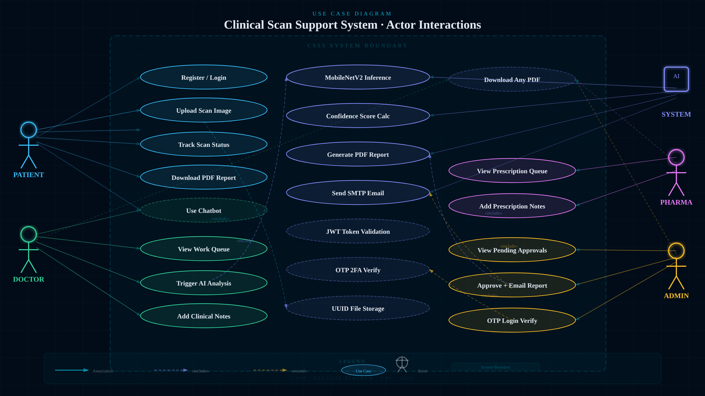 |

| Sequence — Scan Upload | Sequence — Doctor Analysis |
|----------------------|--------------------------|
|  | 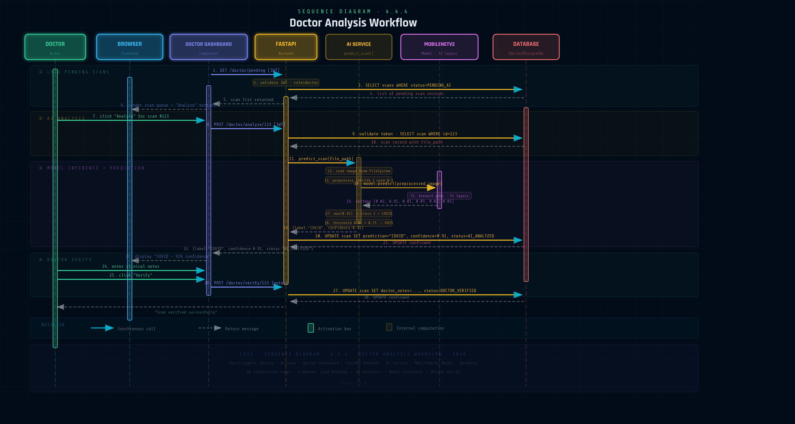 |

| Sequence — Admin Approval | Activity Diagram |
|--------------------------|-----------------|
| 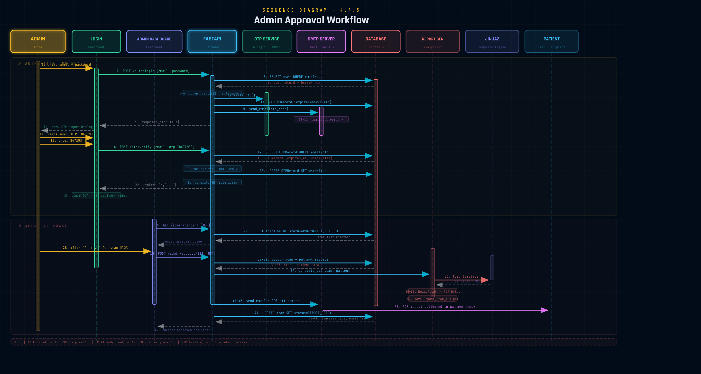 | 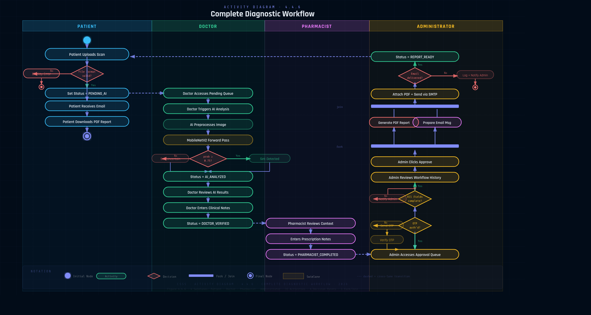 |

| DFD Level 0 | DFD Level 1 |
|------------|------------|
| 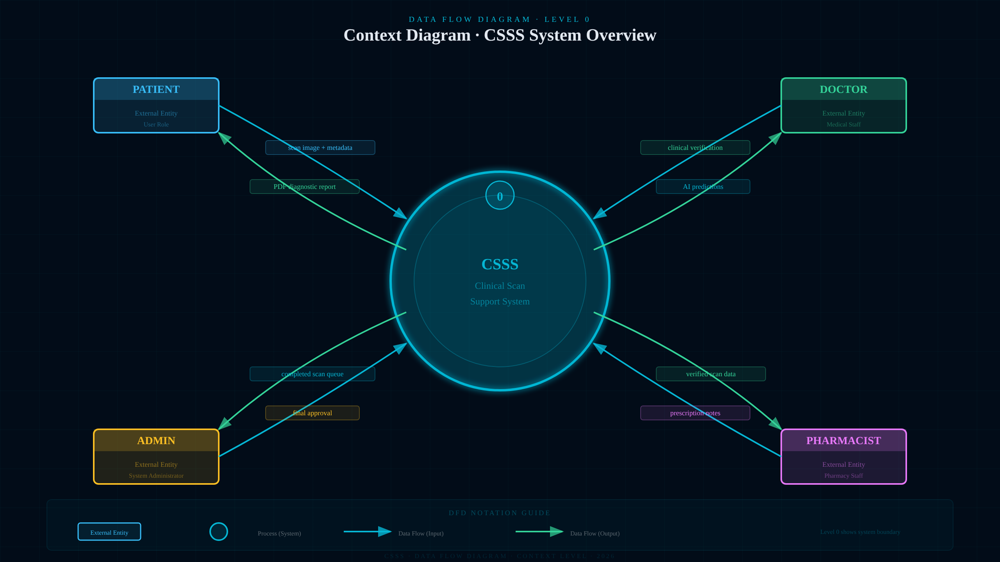 | 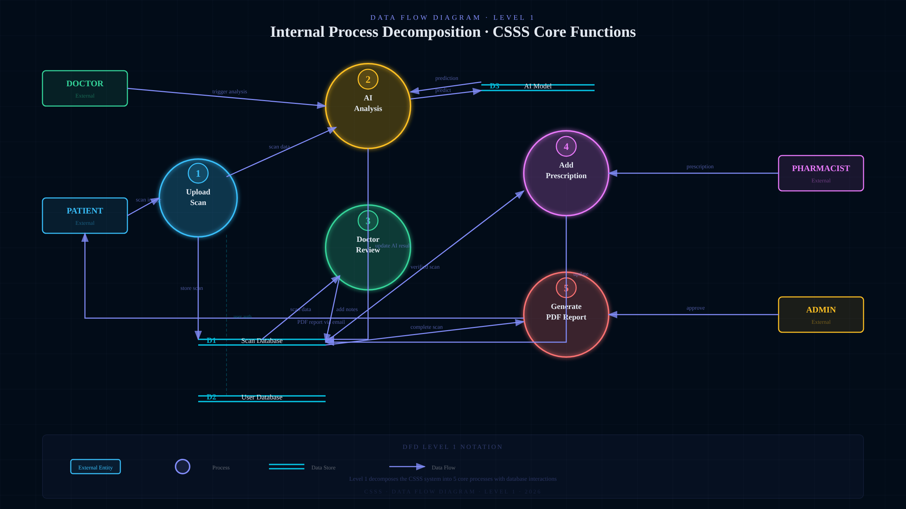 |

| DFD Level 2 — Auth | JWT Auth Flow |
|-------------------|--------------|
|  | 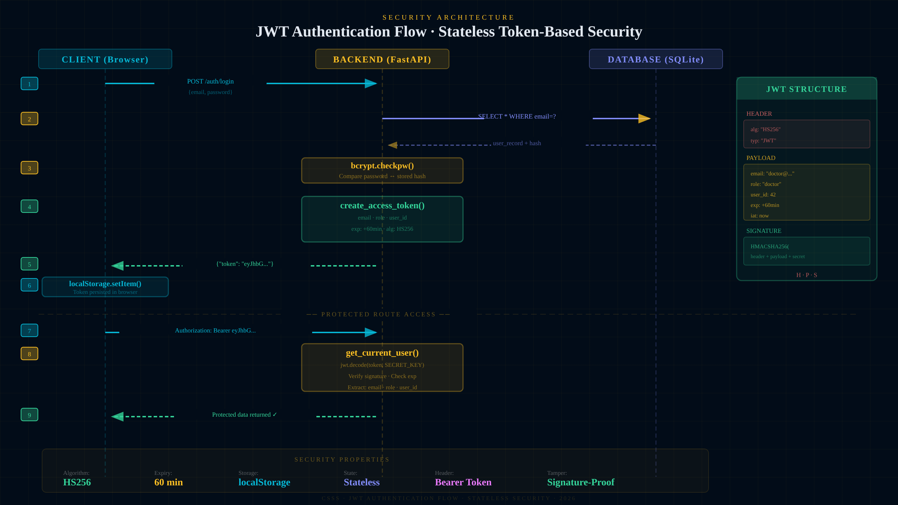 |

| OTP Auth Flow | RBAC Matrix |
|--------------|------------|
| 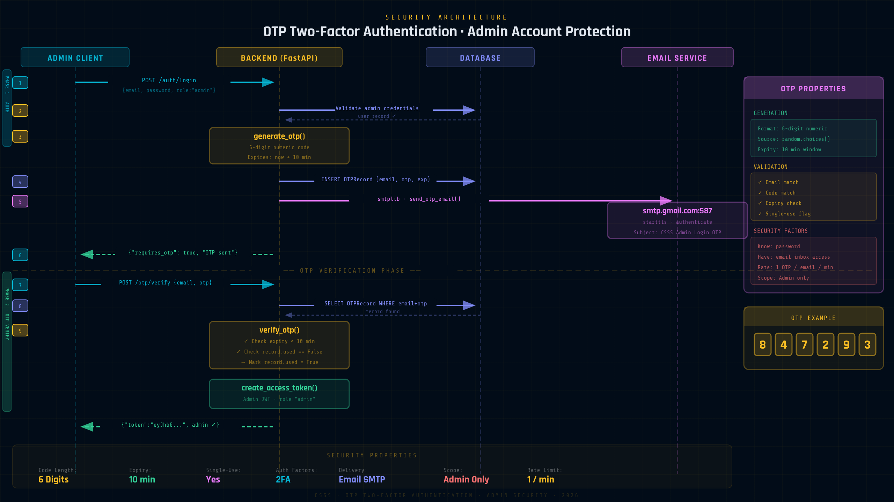 | 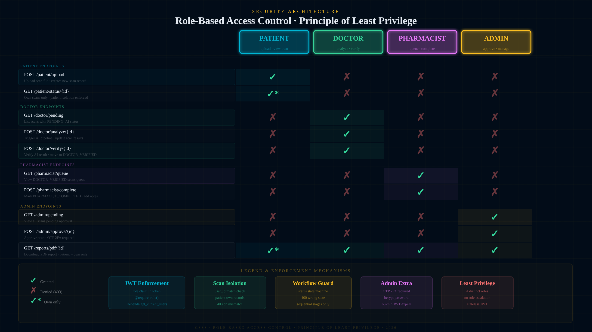 |

| Class Diagram | Entity Relationship |
|--------------|---------------------|
| 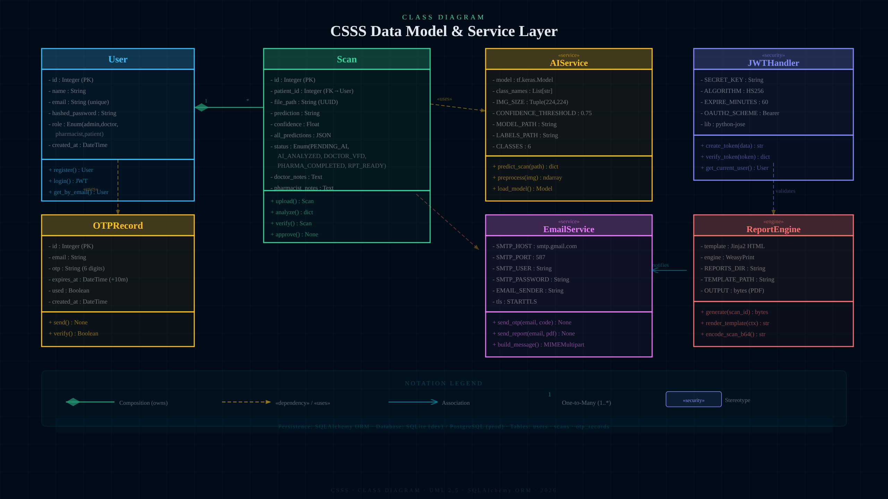 | 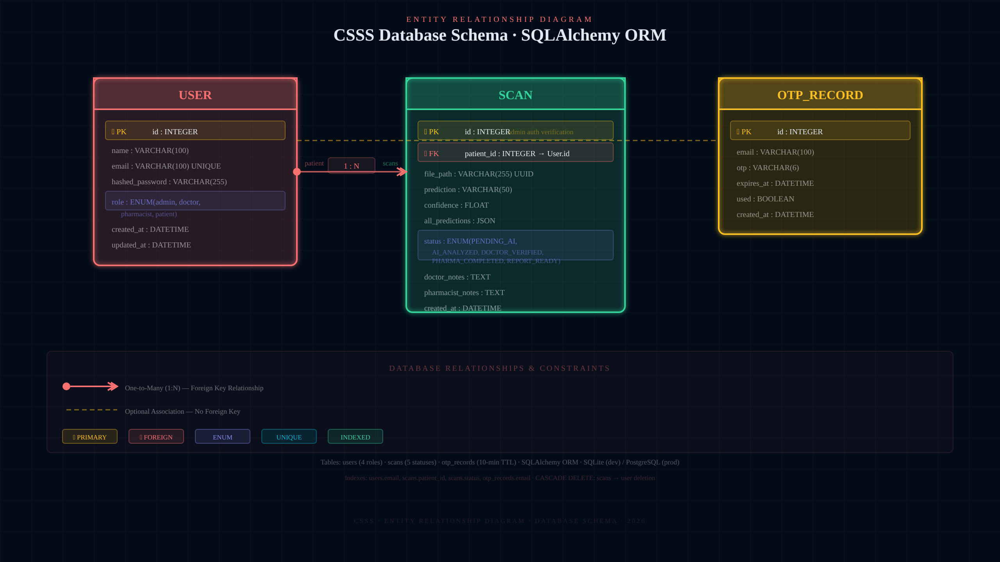 |

| State Diagram — Scan Lifecycle | MobileNetV2 Architecture |
|-------------------------------|--------------------------|
| 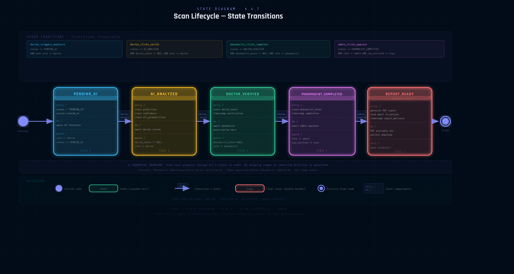 | 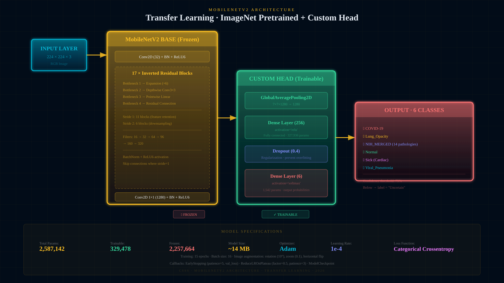 |

| Classification Head | Grad-CAM Visualization |
|--------------------|----------------------|
| 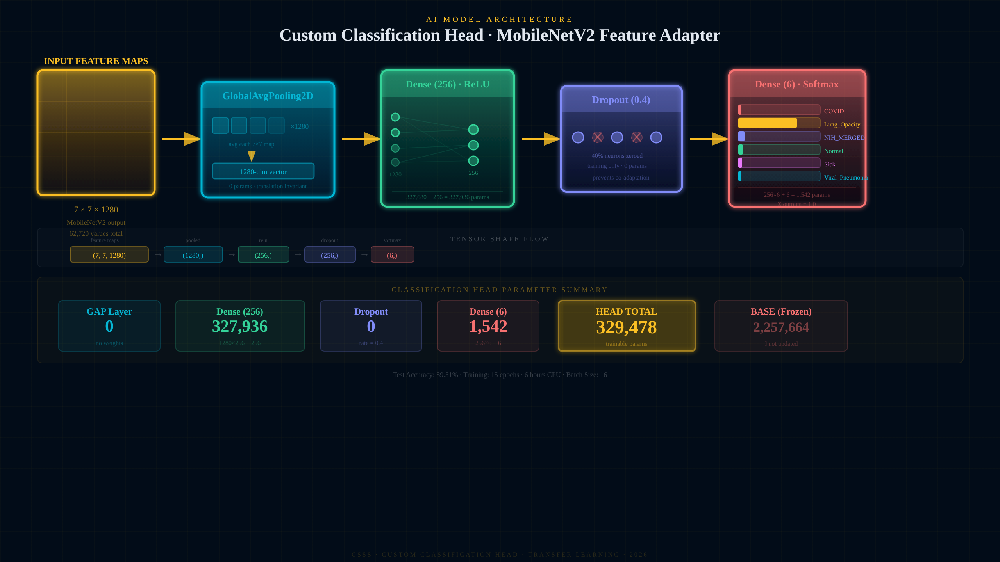 |  |

</div>

</details>

---

## 📚 Research & Publications

| Document | Description |
|----------|-------------|
| 📄 [IEEE Conference Paper](documents/IEEE_Conference_CSSS.pdf) | AI medical imaging methodology |
| 📰 [IEEE Journal Paper](documents/IEEE_Journal_Paper_CSSS.pdf) | Extended MobileNetV2 research |
| 📋 [Full Project Report](documents/FINAL%20PPT.pdf) | System design & results |
| 📎 [Supplementary Material](documents/SUPPLEMENTARY_MATERIAL_CSSS.pdf) | Dataset details & model analysis |

---

## 🗺️ Roadmap

### v2.0 — Q3 2026
- [ ] PostgreSQL migration for production scale
- [ ] Docker Compose full-stack deployment
- [ ] DICOM file format support
- [ ] Grad-CAM heatmap overlays embedded in PDF reports
- [ ] WhatsApp report delivery via Twilio

### v2.5 — Q4 2026
- [ ] Mobile-responsive PWA frontend
- [ ] WebSocket real-time scan status push notifications
- [ ] Multi-language reports (English, Tamil, Hindi)
- [ ] EMR / EHR integration (HL7 FHIR)
- [ ] HIPAA audit logging
- [ ] Federated learning across hospital nodes

---

## 👥 Team

<div align="center">

### 🏆 Core Development Team

<table>
<tr>

<td align="center" width="220">
<a href="https://github.com/Darkwebnew">

</a>
<br/><br/>
<b>Sriram V</b>
<br/>
<sub>🚀 Project Lead & AI/ML Engineer</sub>
<br/>
<sub>MobileNetV2 · FastAPI · DevOps · Full-Stack</sub>
<br/><br/>
<a href="https://github.com/Darkwebnew">

</a>
</td>

<td align="center" width="220">
<a href="https://github.com/surothaaman">

</a>
<br/><br/>
<b>Surothaaman R</b>
<br/>
<sub>⚙️ Backend Developer & Security</sub>
<br/>
<sub>JWT Auth · Role Guard · OTP · Database</sub>
<br/><br/>
<a href="https://github.com/surothaaman">

</a>
</td>

<td align="center" width="220">
<a href="https://github.com/ttamizharasi">

</a>
<br/><br/>
<b>Tamizharasi S</b>
<br/>
<sub>🎨 Frontend Developer</sub>
<br/>
<sub>Next.js 14 · React · Dashboard UI · Chatbot</sub>
<br/><br/>
<a href="https://github.com/ttamizharasi">

</a>
</td>

<td align="center" width="220">
<a href="https://github.com/praveenck23009864">

</a>
<br/><br/>
<b>Praveen CK</b>
<br/>
<sub>🗄️ Database & Testing</sub>
<br/>
<sub>SQLAlchemy · ORM · Integration Tests · QA</sub>
<br/><br/>
<a href="https://github.com/praveenck23009864">

</a>
</td>

</tr>
</table>

<br/>

### 🎓 Academic Advisors

| Role | Name | Institution |
|------|------|-------------|
| Medical Domain Supervisor | **Ms. V. Swedha** | Saveetha Engineering College, Chennai |
| AI/ML Advisor | **Dr. Selvakumar R** | Saveetha Engineering College, Chennai |

</div>

---

## 🤝 Contributing

> ⚠️ **Important:** This project is under a restrictive proprietary license. Contributions are welcome strictly for **educational improvement purposes only.** By submitting a pull request, you agree that your contribution becomes part of this project under the same license terms. No contributor may independently use, redistribute, or commercialize any part of this code.

### How to Contribute

1. **Open an Issue first** — discuss your idea before writing any code
2. **Fork** the repository
3. **Create a branch** — `git checkout -b feature/YourFeature`
4. **Write tests** for all changes
5. **Run checks** — `pytest && black backend/ && flake8 backend/`
6. **Commit** — `git commit -m 'feat: Add YourFeature'`
7. **Push & open a Pull Request** with a detailed description

### Contribution Areas

| Area | Difficulty | Skills Needed |
|------|-----------|--------------|
| 🧠 Model Improvements (new scan types) | Advanced | Python, TensorFlow, Keras |
| 🌐 New API Endpoints | Medium | FastAPI, REST, SQLAlchemy |
| 🎨 Frontend Dashboards | Medium | Next.js, React |
| 📊 Grad-CAM in PDF Reports | Advanced | TensorFlow, WeasyPrint |
| 📚 Documentation | Beginner | Markdown |
| 🧪 Test Coverage | Medium | pytest |

Please read [CODE_OF_CONDUCT.md](CODE_OF_CONDUCT.md) before contributing.

---

## ☕ Support the Project

<div align="center">

**If CSSS helped your research, institution, or medical project — consider supporting continued development!**

<br/>

<a href="https://www.buymeacoffee.com/darkwebnew" target="_blank">

</a>

<br/><br/>

*Your support helps maintain this project, publish more IEEE research, and build better AI healthcare tools for the community.*

<br/>

[](https://github.com/sponsors/Darkwebnew)
[](https://paypal.me/darkwebnew)

</div>

---

## 📄 License

<div align="center">

```
╔══════════════════════════════════════════════════════════════════╗
║              PROPRIETARY SOFTWARE LICENSE                        ║
║     Copyright (c) 2024–2025  Sriram V & CSSS Development Team   ║
║                   All Rights Reserved                            ║
╚══════════════════════════════════════════════════════════════════╝
```

</div>

**This software and all associated source code, documentation, trained ML models, research papers, datasets, configurations, UI designs, screenshots, and assets are the exclusive intellectual property of the authors and are fully protected under applicable copyright law and the Indian Copyright Act, 1957.**

### ❌ You MAY NOT:

- Copy, reproduce, or redistribute this code in whole or in part
- Use this project or any portion of it in commercial medical products or services
- Modify, adapt, translate, or create derivative works based on this project
- Sublicense, sell, rent, lease, or transfer rights to any third party
- Use this project's name, branding, ML models, or research in your own publications without explicit written permission
- Deploy this system in any clinical, production, or commercial environment without written authorization from the authors
- Reverse engineer any trained model weights, binaries, or compiled components
- Present this work as your own in academic, medical, or professional contexts

### ✅ You MAY:

- View and study the source code for **personal educational purposes only**
- Fork the repository on GitHub **solely to submit pull requests**
- Reference this project in academic citations with proper attribution
- Use general concepts and ideas (not code or models) as inspiration for entirely original work

### ⚖️ Legal Notice

Any unauthorized use, reproduction, distribution, or clinical deployment of this software — in whole or in part — is strictly prohibited and may result in civil and criminal penalties under applicable intellectual property and medical device regulation law. The authors reserve all rights and will pursue all available legal remedies for any violations.

> For licensing inquiries, clinical deployment requests, or research collaboration:
> 📧 Contact: sriramnvks@gmail.com · [@Darkwebnew](https://github.com/Darkwebnew) via GitHub Issues

See the full [`LICENSE.txt`](LICENSE.txt) for complete terms.

---

## 🙏 Acknowledgments

<div align="center">

| Source | Contribution |
|--------|-------------|
| **NIH Clinical Center** | Chest X-Ray8 Dataset (112,120 images) |
| **Tawsifur Rahman et al.** | COVID-19 Radiography Database (42,330 images) |
| **CAD Cardiac MRI** | Cardiac scan dataset (63,425 images) |
| **TensorFlow / Keras** | MobileNetV2 deep learning framework |
| **FastAPI** | High-performance Python REST API |
| **Next.js / React** | Frontend SPA framework |
| **WeasyPrint** | HTML → PDF clinical report rendering |
| **SQLAlchemy** | Python ORM |
| **Saveetha Engineering College** | Academic infrastructure and guidance |
| **OWASP** | Security best practices reference |

**Academic References:** Howard et al. (MobileNets 2017) · Sandler et al. (MobileNetV2 2018) · Selvaraju et al. (Grad-CAM 2017) · Wang et al. (ChestX-ray8 2017) · Chowdhury et al. (IEEE Access 2020)

</div>

---

## 📞 Contact & Support

| Channel | Link |
|---------|------|
| 📧 Email | sriramnvks@gmail.com |
| 🐛 Bug Reports | [GitHub Issues](https://github.com/Darkwebnew/Projectwork2/issues) |
| 💬 Discussions | [GitHub Discussions](https://github.com/Darkwebnew/Projectwork2/discussions) |
| 📖 API Docs | `http://localhost:8000/docs` (Swagger UI) |

---

<div align="center">


**⭐ Star this repository if CSSS helped your project!**

[](https://github.com/Darkwebnew/Projectwork2/stargazers)
[](https://github.com/Darkwebnew/Projectwork2/network/members)
[](https://github.com/Darkwebnew/Projectwork2/watchers)

<br/>

*Made with ❤️ for better healthcare diagnostics · Saveetha Engineering College · Tamil Nadu, India 🇮🇳*

[🐛 Report Bug](https://github.com/Darkwebnew/Projectwork2/issues) · [💡 Request Feature](https://github.com/Darkwebnew/Projectwork2/issues) · [📖 API Docs](http://localhost:8000/docs)

</div>
